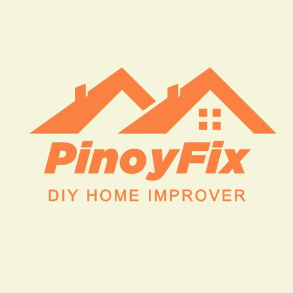

<a name="readme-top">

<br/>

<br />
<div align="center">
  <a href="https://github.com/FEU-TECH-Advance-Web-Design-Ramirez/AWD-FINALS-CROCONAW">
  <!-- TODO: If you want to add logo or banner you can add it here -->
    
  </a>
<!-- TODO: Change Title to the name of the title of your Project -->
  <h3 align="center">PinoyFix</h3>
</div>
<!-- TODO: Make a short description -->
<div align="center">
PinoyFix is a user-friendly mobile app that helps homeowners and DIY enthusiasts with home improvement projects through guided tutorials, tool suggestions, and a vibrant community forum.
</div>

<br />

<!-- TODO: Change the zyx-0314 into your github username  -->
<!-- TODO: Change the WD-Template-Project into the same name of your folder -->


[](https://wakatime.com/badge/user/3ada2a98-2f9d-4f58-a659-147297308f4c/project/c0c31789-07e4-4615-ae3f-086a5ef34c2b)

---

<br />
<br />

<!-- TODO: If you want to add more layers for your readme -->
<details>
  <summary>Table of Contents</summary>
  <ol>
    <li>
      <a href="#overview">Overview</a>
      <ol>
        <li>
          <a href="#key-components">Key Components</a>
        </li>
        <li>
          <a href="#technology">Technology</a>
        </li>
      </ol>
    </li>
    <li>
      <a href="#rule,-practices-and-principles">Rules, Practices and Principles</a>
    </li>
    <li>
      <a href="#resources">Resources</a>
    </li>
  </ol>
</details>

---

## Overview

<!-- TODO: To be changed -->
<!-- The following are just sample -->
Description of the project in details.


- **PinoyFix** is a home improvement app offering essential resources and a collaborative platform for DIY enthusiasts.
- Designed for:
  - Homeowners
  - DIY enthusiasts
  - Hobbyists interested in home improvement
- Features:
  - Step-by-step project guides
  - Tool recommendations
  - Supportive community forum
- Purpose:
  - Make DIY home improvement more accessible
  - Engage users in hands-on projects

### Key Components
<!-- TODO: List of Key Components -->
<!-- The following are just sample -->
- MultiPage Website/Single Page Website
- Parallax transition for a seamless visual experience
- Transactional Features for user engagement and interaction

### Technology
<!-- TODO: List of Technology Used -->


## Rules, Practices and Principles
1. Always use `WD-` in the front of the Title of the Project for the Subject followed by your custom naming.
2. Do not rename any .html files; always use `index.html` as the filename.
3. Place Files in their respective folders.
4. All file naming are in camel case.
   - Camel case is naming format where there is no white space in separation of each words, the first word is in all lower case while the succeding words first letter are in upper followed by lower cased letters.
   - ex.: buttonAnimatedStyle.css
5. Use only `External CSS`.
6. Renaming of Pages folder names are a must, and relates to what it is doing or data it holding.
7. File Structure to follow below.

```
AWD-FINALS-CROCONAW
├── assets
│   ├── css
|   |   ├── style.css
│   ├── img
│   │   ├── andrew pic.jpg
│   │   ├── jerome pic.jpg
│   │   ├── lourd picc.jpg
│   │   ├── nyebe_white.png
│   │   ├── PinoyFix-logo.png
│   │   ├── skob pic.jpg
│   ├── js
|   |   ├──scripts.js
├── pages
│   ├── page1
│   │   ├── assets
│   │   │   ├── css
│   │   │   │   ├── style.css
│   │   │   ├── js
|   |   |   |   ├──scripts.js
│   │   ├── index.html
│   ├── page2
│   │   ├── assets
│   │   │   ├── css
│   │   │   │   ├── style.css
│   │   │   ├── js
|   |   |   |   ├──scripts.js
│   │   ├── index.html
│   ├── page3
│   │   ├── assets
│   │   │   ├── css
│   │   │   │   ├── style.css
│   │   │   ├── js
|   |   |   |   ├──scripts.js
│   │   ├── index.html
│   ├── page4
│   │   ├── assets
│   │   │   ├── css
│   │   │   │   ├── style.css
│   │   │   ├── js
|   |   |   |   ├──scripts.js
│   │   ├── index.html
│   ├── page5
│   │   ├── assets
│   │   │   ├── css
│   │   │   │   ├── style.css
│   │   │   ├── js
|   |   |   |   ├──scripts.js
│   │   ├── index.html
│   ├── page6
│   │   ├── assets
│   │   │   ├── css
│   │   │   │   ├── style.css
│   │   │   ├── js
|   |   |   |   ├──scripts.js
│   │   ├── index.html
│   ├── page7
│   │   ├── assets
│   │   │   ├── css
│   │   │   │   ├── style.css
│   │   │   ├── js
|   |   |   |   ├──scripts.js
│   │   ├── index.html
├── index.html
├── LICENSE
├── plan.md
├── readme.md

```

## Resources

<!-- TODO: Add References -->
| Title | Purpose | Link |
|-|-|-|
| ChatGPT | Ideas and assistance in debugging | https://chat.openai.com |
| Autodesk Instructables | DIY project guides and inspiration and photos | https://www.instructables.com |
| Figma | UI/UX design and prototyping | https://www.figma.com |
| W3Schools | Web development tutorials | https://www.w3schools.com |